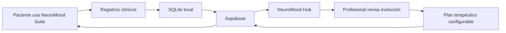

# NeuroMood

**Aplicación de escritorio para acompañamiento terapéutico entre sesiones.**

NeuroMood combina una app para pacientes y un panel profesional para convertir el plan terapéutico en acciones diarias, registros estructurados, seguimiento clínico y reportes exportables.

> NeuroMood no diagnostica, no reemplaza la psicoterapia y no toma decisiones clínicas autónomas. Es una herramienta de apoyo, trazabilidad y organización clínica.

---

## Qué es

NeuroMood es un ecosistema de escritorio dividido en dos aplicaciones:

| Aplicación | Audiencia | Propósito |
|---|---|---|
| **NeuroMood Suite** | Pacientes en seguimiento | Registrar ánimo, practicar habilidades terapéuticas, sostener rutinas y completar actividades indicadas por el profesional. |
| **NeuroMood Hub** | Profesionales tratantes | Consultar evolución, configurar planes terapéuticos, revisar adherencia, generar resúmenes asistidos por IA y exportar reportes. |

La idea central es simple: **lo que ocurre entre sesiones también forma parte del tratamiento**.  
La Suite recoge datos cotidianos; el Hub los organiza para que el profesional pueda leerlos, ajustar el plan y trabajar con mayor contexto clínico.

---

## Flujo general

El circuito es bidireccional:

- **Suite → Hub:** el paciente registra ánimo, respiración, pensamientos, habilidades, rutina, actividades, timer y recordatorios completados.
- **Hub → Suite:** el profesional asigna recordatorios, temporizadores, tareas, actividades y textos personalizados.
- **IA asistiva:** el Hub puede generar borradores y resúmenes, siempre como apoyo revisable por el profesional.

---

## NeuroMood Suite

**Suite** es la aplicación diaria del paciente. Funciona como un cuaderno clínico digital estructurado: cada registro queda asociado a fecha, hora y contexto, y puede sincronizarse con el profesional.

### Módulos principales

| Familia | Módulo | Función |
|---|---|---|
| Bienestar emocional | **Ánimo** | Registro subjetivo diario en escala 1–10. |
| Bienestar emocional | **Respiración 4·7·8** | Guía de regulación fisiológica. |
| Registro cognitivo-conductual | **TCC** | Registro de pensamiento en pasos estructurados. |
| Registro cognitivo-conductual | **DBT** | Práctica guiada de habilidades terapéuticas. |
| Hábitos y adherencia | **Rutina diaria** | Checklist por franjas del día. |
| Hábitos y adherencia | **Activación conductual** | Actividades según plan terapéutico. |
| Hábitos y adherencia | **Temporizador** | Sesiones de foco o actividad. |
| Hábitos y adherencia | **Recordatorios** | Avisos de bienestar y horarios configurables. |

### Qué permite

- Registrar datos clínicos cotidianos sin depender de la memoria de la sesión.
- Usar la aplicación offline y sincronizar después cuando vuelve la conexión.
- Mantener continuidad al cambiar de computadora mediante la misma cuenta.
- Recibir configuraciones terapéuticas definidas desde el Hub.
- Alternar tema claro/oscuro para uso prolongado.

---

## NeuroMood Hub

**Hub** es la aplicación profesional. Está orientada a seguimiento, configuración y lectura clínica operativa.

### Funciones principales

| Área | Función |
|---|---|
| Dashboard | Lista activa de pacientes, tendencia de ánimo, adherencia y última actividad. |
| Ficha de paciente | Vista de evolución con secciones clínicas consultables. |
| Plan terapéutico | Recordatorios, temporizadores, rutina diaria y activación conductual por paciente. |
| IA asistiva | Resumen clínico estructurado y generación de borradores de asignaciones. |
| Reportes | Exportación PDF de evolución para sesión, impresión o adjunto clínico. |
| Personalización | Edición de textos clínicos visibles en la Suite. |
| Gestión | Desvinculación de pacientes sin borrar historial. |

---

## IA integrada

El Hub incorpora IA como herramienta asistiva, no como autoridad clínica.

Puede ayudar a:

- resumir registros extensos;
- estructurar un borrador de lectura clínica;
- sugerir redacciones de asignaciones;
- ahorrar tipeo operativo;
- trabajar con fallback multi-proveedor según disponibilidad.

No debe usarse para:

- emitir diagnósticos;
- indicar medicación;
- decidir por el profesional;
- reemplazar la lectura clínica;
- monitorear crisis de forma automática.

Cada salida generada por IA debe ser revisada antes de incorporarse al trabajo terapéutico.

---

## Arquitectura resumida

NeuroMood está diseñado como aplicación de escritorio con sincronización local/remota.

| Capa | Uso |
|---|---|
| **Desktop app** | Interfaz Suite y Hub. |
| **SQLite local** | Persistencia offline de registros y estado local. |
| **Supabase** | Sincronización, Auth, PostgreSQL, RLS y almacenamiento remoto. |
| **RLS / JWT** | Aislamiento de datos por paciente en Suite. |
| **Service-role Hub** | Acceso profesional controlado desde instalación autorizada. |
| **Audit log IA** | Trazabilidad de proveedor, modelo, prompt, salida y errores. |

---

## Seguridad y privacidad

- La Suite usa identidad por email y autenticación remota.
- Cada paciente solo debe acceder a sus propios registros.
- Los datos pueden persistir localmente cuando no hay conexión.
- Los registros clínicos se sincronizan automáticamente cuando vuelve internet.
- El profesional no ve la contraseña del paciente.
- El Hub requiere custodia estricta de sus credenciales de acceso.
- La IA queda auditada para trazabilidad posterior.

---

## Qué NO es NeuroMood

NeuroMood no es:

- una app de autoayuda standalone;
- un sistema de diagnóstico automático;
- una historia clínica electrónica completa;
- un sistema de emergencia o monitoreo de crisis;
- un reemplazo del criterio profesional;
- un reemplazo de la sesión terapéutica.

Es una herramienta complementaria para estructurar el trabajo entre sesiones y mejorar la continuidad del seguimiento.

---

## Estado del proyecto

Proyecto en desarrollo orientado a:

- experiencia desktop compacta;
- flujo clínico Suite ↔ Hub;
- registros terapéuticos estructurados;
- sincronización local/remota;
- integración IA auditada;
- reportes exportables;
- gobernanza visual y QA reproducible.

---

## Documentación

Los manuales completos del proyecto describen el uso clínico y operativo de cada aplicación:

- `NeuroMood_Suite_Manual_Pacientes.pdf`
- `NeuroMood_Hub_Manual_Profesionales.pdf`

---

## Público objetivo

NeuroMood está pensado para:

- profesionales de salud mental que necesitan seguimiento operativo entre sesiones;
- pacientes en seguimiento activo con un plan terapéutico asignado;
- contextos clínicos donde la adherencia, la trazabilidad y la continuidad del registro son parte central del trabajo.

---

## Aviso clínico

NeuroMood es una herramienta digital complementaria.  
No sustituye evaluación, diagnóstico, indicación médica, psicoterapia, seguimiento profesional ni atención de urgencias.

Toda decisión clínica corresponde al profesional tratante.
